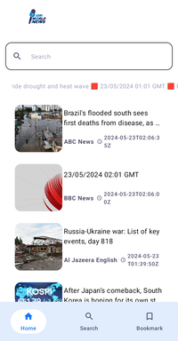

# News App

A modern news app built with Jetpack Compose and a clean architecture using MVVM. The app supports local data storage with DataStore Preferences and Room Database, dependency injection with Dagger Hilt, network requests with Retrofit, and efficient data loading with Paging 3 library. Users can search for news and bookmark articles to read later.




## Key Features

- **Modern UI with Jetpack Compose**: Provides a responsive and intuitive user interface.
- **Clean Architecture**: Ensures a scalable and maintainable codebase following MVVM principles.
- **Local Data Storage**: Uses Room Database and DataStore Preferences for efficient local storage management.
- **Dependency Injection**: Dagger Hilt simplifies dependency management, ensuring a clean and modular code structure.
- **Network Requests**: Retrofit is used for efficient and scalable network operations.
- **Pagination**: Paging 3 library allows for efficient and smooth data loading, especially for large datasets.
- **Search Functionality**: Users can easily search for news articles.
- **Bookmarking**: Allows users to bookmark articles to read later, enhancing the user experience.

## Technologies Used

- **Jetpack Compose**: For building the UI.
- **MVVM Architecture**: For a clean and maintainable codebase.
- **Room Database**: For local storage of data.
- **DataStore Preferences**: For local storage of simple key-value pairs.
- **Dagger Hilt**: For dependency injection.
- **Retrofit**: For making network requests.
- **Paging 3**: For handling pagination of data.

## Installation

1. Clone the repository:
    ```bash
    git clone https://github.com/kashifansari786/news-app.git
    ```

2. Open the project in Android Studio.

3. Build the project:
    ```bash
    ./gradlew build
    ```

4. Run the app on an emulator or physical device.

## Usage

- Search for news articles using the search functionality.
- Bookmark articles to read later.
- Enjoy a seamless and modern user experience with the latest Android technologies.

## Contributing

Contributions are welcome! Please fork the repository and submit a pull request for any enhancements or bug fixes.

## License

This project is licensed under the MIT License - see the [LICENSE](LICENSE) file for details.

## Acknowledgements

- [Jetpack Compose](https://developer.android.com/jetpack/compose)
- [Room Database](https://developer.android.com/training/data-storage/room)
- [DataStore Preferences](https://developer.android.com/topic/libraries/architecture/datastore)
- [Dagger Hilt](https://dagger.dev/hilt/)
- [Retrofit](https://square.github.io/retrofit/)
- [Paging 3](https://developer.android.com/topic/libraries/architecture/paging/v3)
